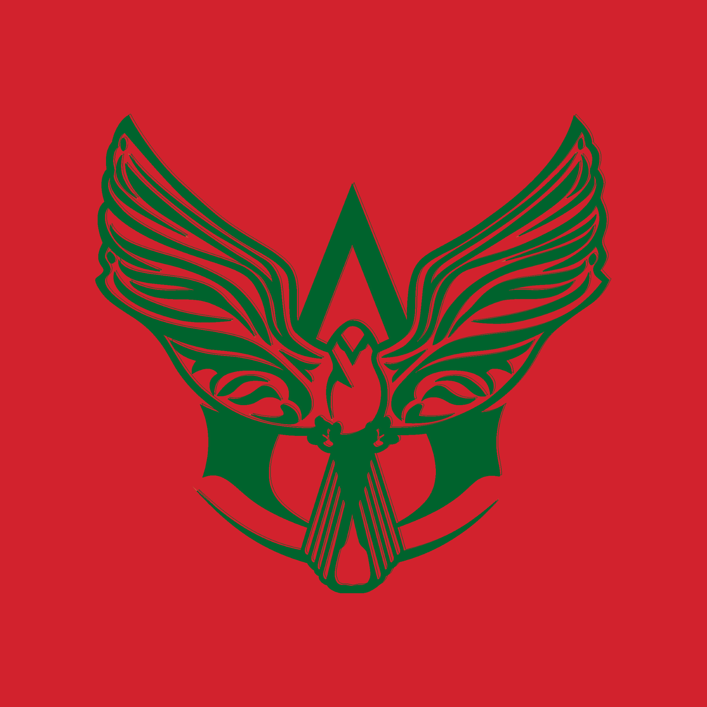

    <h1 align="center">Hi there, I'm <a href="https://afoulky.ga">Afoulky</a> 
        
    </h1>
    

        
    

    <h2> About Me:</h2>
     - 😄 I'm a 21 year old man 
     - 💻 I’m currently studying Computer Science at <a href="https://github.com/epita">EPITA</a> 
     - ⚡ Fun fact: My pseudo means "beautiful" in <a href="https://en.wikipedia.org/wiki/Shilha_language">Tashelhit</a> (Amazigh/Berber language of Morocco) 
    <h2>📫 How to reach me:</h2>
    
    
    
    <h2>My Stats  </h2>
    

        
        
    

    

        
        
    

